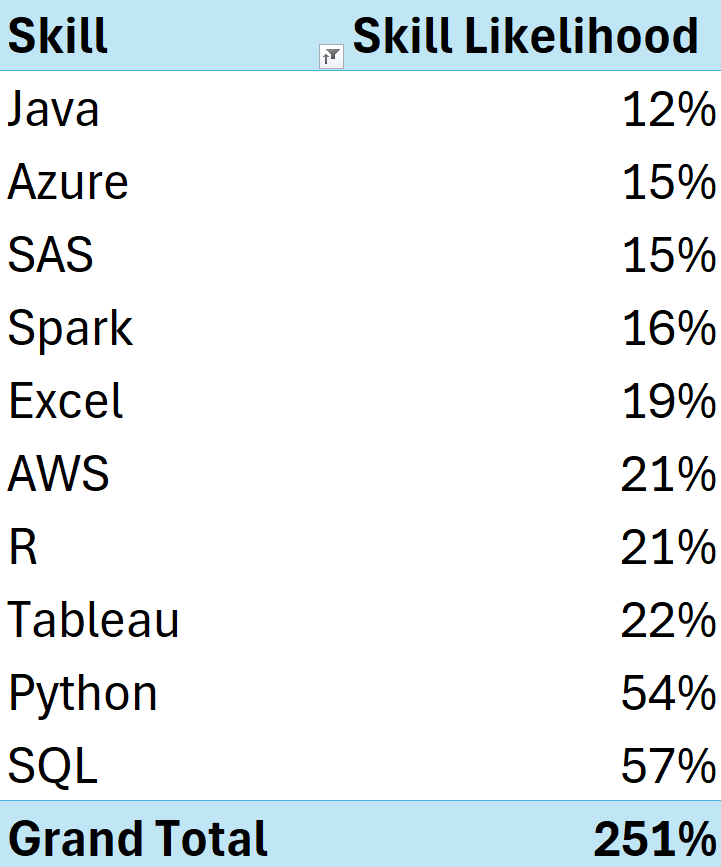

# Introduction
📊 **Data Profession Analysis** is the study of various roles within the data industry, focusing on skills market demand, salary trends, and career paths. This analysis helps professionals and organizations understand the evolving landscape of data-related jobs, including data scientists, analysts, engineers, and especially **AI specialists**.

### **Key Areas of Analysis:**
- **Job Roles & Responsibilities** – Understanding the differences between data analysts, data scientists, data engineers, and other roles.

- **Skill Requirements** – Identifying key technical (e.g., SQL, Python, machine learning) and soft skills (e.g., communication, problem-solving) for success in data professions.

- **Market Trends** – Analyzing job demand, salary trends, and industry preferences across regions.

- **Career Growth & Transitions**– Exploring career paths, required upskilling, and how professionals can transition between roles.

### **Importance**

- Helps aspiring data professionals choose the right career path.

- Guides organizations in hiring the right talent.

- Provides insights into future trends in data-related jobs.

# Excel Skills Used
- **Pivot Tables**
- **Pivot Chart**
- **Power Querry**
- **Power Pivot**
- **DAX (Data Analysis Expressions)**

# The analysis
### 1. In-demanded Skills For Data Professions
**Here are some key insights from your data on skill likelihood percentages:**

  

1. **SQL and Python Dominate the List**
**SQL (57%) and Python (54%)** have the highest likelihood, meaning they are the most commonly required or used skills.
**These two are essential in data-related roles** like data engineering, data science, and analytics.

2. **Data & Cloud Skills** Are in High Demand
**AWS (21%) and Azure (15%)** show the demand for cloud computing knowledge.
Spark (16%) and SAS (15%) are also notable, indicating a need for big data processing and analytics expertise.

3. **Business Intelligence & Analytics Are Key**
**Tableau (22%) and Excel (19%)** suggest a strong demand for data visualization and reporting.
**R (21%)** supports statistical analysis and data science applications.

4. **Java Has the Lowest Likelihood** **(12%)**
Despite Java's widespread use in software development, its lower percentage suggests that it is less critical in this particular dataset compared to data, cloud, and analytics skills.

5. **The Total Percentage Exceeds 100% (251%)**
This suggests that multiple skills are often required together. For example, SQL and Python are frequently used together in data roles.

### Compare that trends with Machine Learning Engineer in U.S.:

### **Key Insights:**

- **Python** **is** **Critical in Both Fields**

- **Machine Learning Engineers (ML Engineers**) value Python more (65%) than general data roles (54%).

- **Machine Learning Engineers Focus on AI/Deep Learning**

- **PyTorch (31%) and TensorFlow (33%)** are **highly relevant** for **ML roles** but absent in the general dataset.

- **These frameworks are essential for deep learning and neural networks.**

- Cloud Computing is Important for Both, but with Differences

- **AWS is more in demand for ML Engineers (27% vs. 21%).**

- GCP (12%) appears in ML Engineer roles but not in the general dataset.

- SQL is More Important in General Data Roles

- **SQL is dominant (57%)** in general data-related jobs but significantly lower (23%) for ML Engineers.

- Suggests ML Engineers work more with unstructured data and models than with relational databases.

- **Tableau, Excel, and SAS Are Missing** for ML Engineers

- **General roles** emphasize BI tools like **Tableau (22%) and Excel (19%)**, whereas **ML Engineers focus on AI tools**.

- **Java** is More Important for ML Engineers

- **Java (22%)** is **more relevant** in **ML Engineering** than in general data-related roles (12%), likely due to ML frameworks like Apache Spark and large-scale system deployments.

### **Key Takeaways**
✅ **For general data roles:** SQL, Python, Tableau, and Excel are crucial.  
✅ **For ML Engineers:** Python, AI frameworks (PyTorch/TensorFlow), and cloud computing (AWS/GCP) matter more.  
✅ **SQL and BI tools** are less relevant for ML Engineers, while deep learning and programming (Java) become more significant.

### **Comparison: General Skills vs. Machine Learning Engineer Skills in the U.S.**
| Skill        | General Likelihood (%) | ML Engineer Likelihood (%) | Difference (%) |
|-------------|----------------------|---------------------------|--------------|
| **Python**      | 54  | **65**  | **+11**  |
| **SQL**         | **57** | 23  | **-34**  |
| **AWS**         | 21  | **27**  | **+6**  |
| **Azure**       | 15  | 13  | -2  |
| **Spark**       | 16  | 16  | 0  |
| **Java**        | 12  | **22**  | **+10**  |
| **R**           | 21  | 16  | -5  |

### 2. Top Median Salary For Data Professions (And Number Of Required Skills Per Job)
### **Insights from the Data on Salaries & Skills per Job**  

1. **Senior Data Scientists Earn the Most**  
   - With a **median salary of $155,000**, Senior Data Scientists are the highest earners in this dataset.
   - They require an **average of 5.3 skills per job**, which is moderate compared to other roles.

2. **Data Engineers Require More Skills**  
   - **Senior Data Engineers** have the **highest skill demand (8.1 skills per job)** yet earn slightly less than Senior Data Scientists at **$147,500**.  
   - **Data Engineers** also require a high **7.0 skills per job**, with a median salary of **$125,000**.

3. **Data Analysts & Business Analysts Earn the Least**  
   - **Data Analysts** and **Business Analysts** are at the bottom, with **$90,000** and **$85,000** median salaries, respectively.  
   - They also require the fewest skills: **3.6 for Data Analysts** and **3.3 for Business Analysts**.

4. **More Skills ≠ Higher Salary**  
   - **Cloud Engineers ($90,000, 4.8 skills)** and **Software Engineers ($99,150, 5.5 skills)** earn less than some roles requiring fewer skills.  
   - This suggests that **specific skill types matter more than the sheer number of skills**.
5. **Machine Learning vs. Software Engineering**

   - **Machine Learning Engineers ($107,550)** **earn more** than **Software Engineers** **($99,150)**.  
   - **Suprisingly,** both roles have a **similar skill requirement** (~5.3-5.5 skills per job), **implying ML expertise commands a premium over general software development.**

6. **Overall Median Salary & Skill Count**  
   - The **overall median salary is $115,000**, with an average of **5.1 skills per job**.
   - Positions above this median: Senior roles, Data Scientists, and Data Engineers.
   - Positions below this median: Analysts, Cloud Engineers, and Software Engineers.

### **Key Takeaways**
 ✅ **Experience pays** – Senior roles lead in salary.  
 ✅ **Specialized roles (Data Scientists, Engineers) earn more than generalist roles (Analysts).**    
 ✅ **Skill demand varies significantly** – More skills don’t always mean a higher paycheck.

### 3. Salary Analysis
| Role                      | Median Salary | Median Salary US | Median Salary Non-US |
|---------------------------|--------------|------------------|----------------------|
| **Business Analyst**      | $85,000      | $90,000          | $75,000              |
| **Cloud Engineer**        | $90,000      | $115,000         | $89,100              |
| **Data Analyst**          | $90,000      | $90,000          | $90,000              |
| **Data Engineer**         | $125,000     | $125,000         | $123,500             |
| **Data Scientist**        | $127,500     | $130,000         | $119,550             |
| **ML Engineer**           | $107,550     | $150,000         | $101,029             |
| **Senior Data Analyst**   | $111,175     | $110,000         | $111,175             |
| **Senior Data Engineer**  | $147,500     | $150,000         | $147,500             |
| **Senior Data Scientist** | $155,000     | $155,000         | $155,000             |
| **Software Engineer**     | $99,150      | $125,000         | $89,100              |
| **Grand Total**           | $115,000     | $118,940         | $111,175             |

### **Insights from Salary Data (US vs. Non-US Comparison)**  

1. **US Salaries Are Higher Overall**  
   - The **average median salary in the US is $118,940**, while **Non-US salaries average $111,175**.  
   - **US salaries are about 7% higher overall**, reflecting higher living costs and market demand.  

2. **Roles with the Largest US Salary Advantage**  
   - **Machine Learning Engineers**:  
     - **US Salary: $150,000** vs. **Non-US Salary: $101,029** (~48% higher in the US).  
     - This is the **largest salary gap**, indicating high demand for ML Engineers in the US.  
   - **Software Engineers**:  
     - **US Salary: $125,000** vs. **Non-US Salary: $89,100** (~40% higher in the US).  
     - Suggests more competitive compensation for software roles in the US.  
   - **Cloud Engineers**:  
     - **US Salary: $115,000** vs. **Non-US Salary: $89,100** (~29% higher in the US).  
     - Cloud infrastructure expertise is highly valued in the US.  

3. **Roles with Minimal Salary Differences**  
   - **Data Analyst**: **$90,000 (US) vs. $90,000 (Non-US)** (No difference).  
   - **Senior Data Analyst**: **$110,000 (US) vs. $111,175 (Non-US)** (Very small difference).  
   - **Senior Data Engineer**: **$150,000 (US) vs. $147,500 (Non-US)** (~1.7% difference).  
   - These suggest **some roles are more globally standardized**, with little pay variation.  

4. **Highest Paying Roles**  
   - **Senior Data Scientist** has the highest salary at **$155,000** (both US and Non-US).  
   - **Senior Data Engineer ($147,500) and Data Scientist ($127,500)** also earn high salaries.  

5. **Lowest Paying Roles**  
   - **Business Analysts earn the least ($85,000)**, with a **Non-US salary of just $75,000**.  
   - **Cloud Engineers in Non-US locations earn $89,100**, which is significantly lower than in the US.  
   

### **Key Takeaways**  
✅ **US-based professionals earn more, particularly in AI/ML, Cloud, and Software Engineering.**  
✅ **Data Analysts and Senior Analysts have more balanced salaries worldwide.**  
✅ **Senior roles (Data Scientist, Data Engineer) maintain high pay in both US and Non-US markets.**  
✅ **Machine Learning is the most lucrative in the US, with a 48% salary difference.**  

### 4. Pay of Top 10 In-Demanded Skills

### **Insights from Skills & Salaries Data**  

1. **Highest Paying Skills**  
   - **Spark ($140,000), AWS ($135,000), and Java ($134,241)** are the most lucrative skills.  
   - These technologies are in high demand for **big data, cloud computing, and backend development**.  

2. **Most Commonly Required Skills**  
   - **SQL (57%) and Python (54%)** appear most frequently in job descriptions.  
   - These foundational data skills are essential for most data-related roles.  

3. **Cloud & Big Data Pay Well**  
   - **AWS ($135,000) and Azure ($125,000)** offer high salaries, reinforcing the demand for **cloud computing expertise**.  

4. **Lower-Paying Yet Common Skills**  
   - **Excel ($92,500) and Tableau ($111,175)** are lower-paying but still widely required (19% and 22% likelihood).  
   - Suggests that **basic data visualization and reporting skills** are valuable but less specialized.  

5. **Overall Trend**  
   - The **average median salary across skills is $117,500**.  
   - **Higher salaries are associated with big data (Spark), cloud (AWS, Azure), and backend development (Java, Python, SQL).**  

### **Key Takeaways**  
✅ **Big data (Spark) and cloud (AWS, Azure) skills command the highest salaries.**  
✅ **SQL and Python are the most in-demand skills across data roles.**  
✅ **Excel and Tableau, while useful, offer lower salaries compared to coding and cloud skills.**  

# Conclusion
- **General Data Profession:** Focuses on **SQL, Python, and BI tools (Tableau, Excel)** for **data analysis, reporting, and cloud-based processing (AWS, Azure)**. Strong emphasis on structured data and business insights rather than AI or deep learning.  
- **Machine Learning Engineer:** Prioritizes **Python, TensorFlow, PyTorch, and cloud computing (AWS, GCP)** for **AI model development and deployment**. Less reliance on SQL and BI tools, with a greater need for **big data processing and scalable ML systems**.
- **Senior data roles (Data Scientists, Engineers)** command the **highest salaries**, with **Senior Data Scientists** earning **$155,000 on average**, despite requiring **fewer skills** than **Senior Data Engineers (8.1 skills, $147,500)**. **More skills don’t always mean higher pay**, as seen with **Cloud Engineers ($90,000, 4.8 skills)**. Generalist roles like **Data Analysts ($90,000, 3.6 skills)** and **Business Analysts ($85,000, 3.3 skills)** **earn the least**. The overall median salary is **$115,000**, highlighting **the importance of specialization over skill count in determining salary**.
- **US salaries are generally higher**, averaging **$118,940** compared to **$111,175** for Non-US roles. The largest gaps are in **Machine Learning Engineering (48% higher in the US)**, **Software Engineering (40% higher)**, and **Cloud Engineering (29% higher)**, indicating strong US demand. Some roles, like **Data Analyst and Senior Data Engineer**, have minimal salary differences worldwide. **Senior Data Scientists earn the most ($155,000), while Business Analysts earn the least ($85,000).** Overall, **AI/ML, Cloud, and Software roles benefit the most from US salary premiums.** 
- Big data (**Spark - $140K**) and cloud skills (**AWS - $135K, Azure - $125K**) offer the highest salaries, while **SQL (57%) and Python (54%)** are the most in-demand skills. **Java ($134K)** is also highly valued for backend development. Lower-paying but common skills include **Excel ($92.5K) and Tableau ($111K)**, useful for reporting but less specialized. Overall, **high salaries align with cloud, big data, and coding expertise, while fundamental tools like SQL and Python remain essential.** 